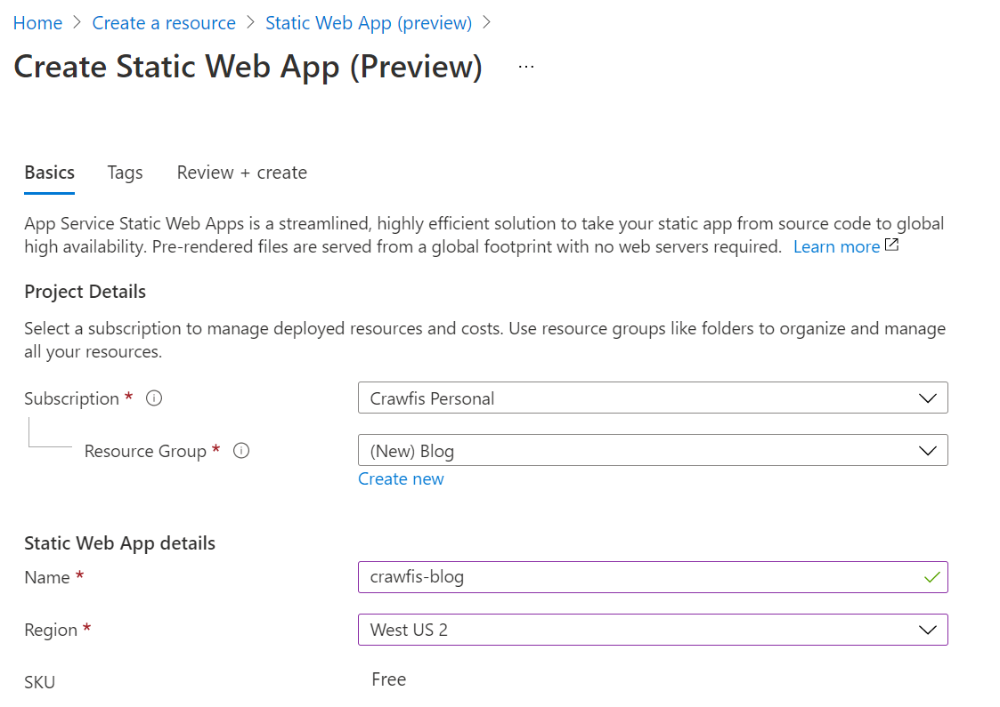
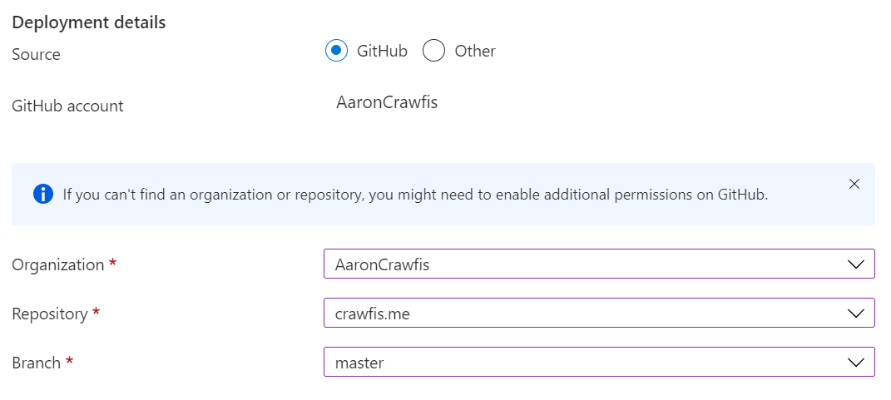
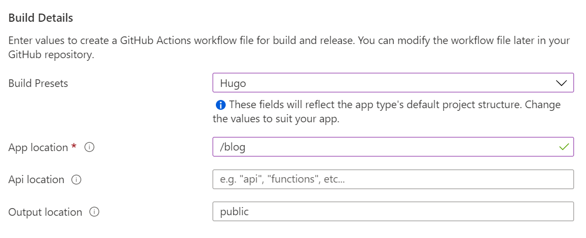
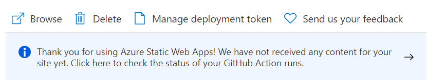
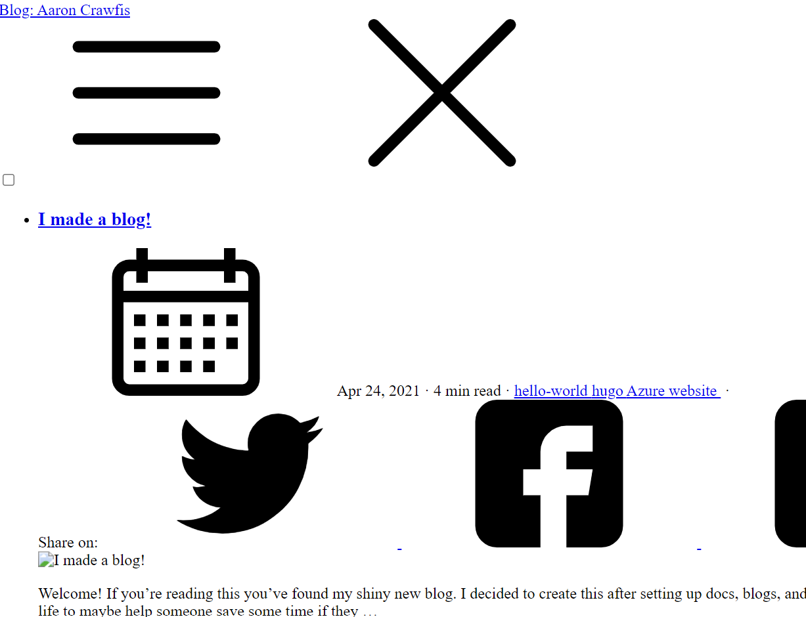

Welcome! If you're reading this you've found my shiny new blog. I decided to create this after setting up docs, blogs, and websites for a bunch of projects ([docs.dapr.io](https://docs.dapr.io), [blog.dapr.io](https://blog.dapr.io/posts)) and figured I could start a series on how I build things in my day-to-day life to maybe help someone save some time if they want to build something similar.

To begin, here's how I created this blog.

## Pre-requisites

- [Hugo extended](https://github.com/gohugoio/hugo/releases) - I prefer Hugo for docs and blogs, as it has lots of theme options and is extremely extensible.
- [Free Azure subscription](https://azure.com) - We're going to be using Static Web Apps, which are completely free, so no need to break out the credit card
- [GitHub account](https://github.com) - We're going to be using GitHub Actions later on, but Azure DevOps Pipelines is also supported if preferred.

## Setup

There are a bunch of options to setup the repo in the [theme guide](https://github.com/chipzoller/hugo-clarity), but I followed the recommended options:

1. Create a new repo on GitHub. Select the option to initialize a README.
1. Clone the repo to your local machine.
1. Create a new directory named `blog`:
   ```bash
   mkdir blog
   ```
1. Initialize a new Hugo website:
   ```bash
   hugo new site ./blog
   ```
1. Add the [Hugo-Clarity theme](https://github.com/chipzoller/hugo-clarity) as a submodule:
   ```bash
   git submodule add https://github.com/chipzoller/hugo-clarity themes/hugo-clarity
   ```
1. Add `theme = "hugo-clarity"` to the bottom of `config.toml`, located in your blog directory.
1. Run a local server to verify that your blog is working:
   ```bash
   cd blog
   hugo server
   ```
1. Visit http://localhost:1313 to verify your site is up and running.

## Create your first blog post

1. Open `config.toml` and add the following line to configure the main blog directory:
   ```toml
   mainSections = ["post"]
   ```
1. Create a new directory within `blog` named `post`:
   ```bash
   mkdir post
   ```
1. Create a file named `_index.md` which will be a default landing page. Add the following front-matter to the empty file:
   ```toml
   +++
   aliases = ["posts", "articles", "blog", "showcase", "docs"]
   title = "Posts"
   author = "Your name"
   tags = ["index"]
   +++
   ```
1. Create another file named `my-first-post.md` within the `post` directory and add the following front-matter:
   ```toml
   +++
   author = "Your name"
   title = "My first blog post"
   date = "2021-04-24"
   description = "Check out my very first blog post using Hugo."
   featured = true
   tags = [
       "blog",
       "hello",
       "first",
       "amazing",
       "wow"
   ]
   categories = [
       "hello",
       "world",
   ]
   series = ["My cool things"]
   +++
   ```
1. Run a local server to check out your post:
   ```bash
   hugo server
   ```
1. Visit http://localhost:1313 to check out your first post
1. Done! You now have a blog with your first post.

But wait! How do other people see it?

## Push to GitHub

1. Commit your changes:
   ```bash
   cd ..
   git add *
   git commit -m "Creating a new blog site"
   ```
1. Push your changes:
   ```bash
   git push
   ```

## Deploy to an Azure Static Web App

Static Web Apps are perfect for blogs, documentation, and other static content which is read-only. Plus, they're free!

These steps adapt the [Static Web App docs](https://docs.microsoft.com/en-us/azure/static-web-apps/get-started-portal).

1. Navigate to portal.azure.com
1. Select `Create a Resource`
1. Search for "Static Web Apps"
1. Select `Static Web Apps (Preview)`
1. Select `Create`
1. Fill in your Azure subscription, resource group, app name, region closest to you, and Free SKU.
   
1. Sign in with GitHub and select your account, repo, and the branch you just pushed to.
   
1. Select `Hugo` from the *Build Presets* and select:
  - App location = `/blog`
  - Api location = blank
  - App artifact location = `public`
  
1. Select `Review + create`
1. Select `Create`
1. Wait for deployment to complete, and then click `Go to resource`
1. Click the banner indicating the build is still underway
   
1. Wait for the build to complete
1. Back in Azure, open the Static Web App URL and see that the website looks bad. There's one last step.
   
1. Open `config.toml`, and update the `baseURL` field to match the Static Web App URL that was generated for you.
1. Commit and push your change, and wait for the build to complete.
1. Done! Now any pushes you make to your repo will rebuild and republish the site.